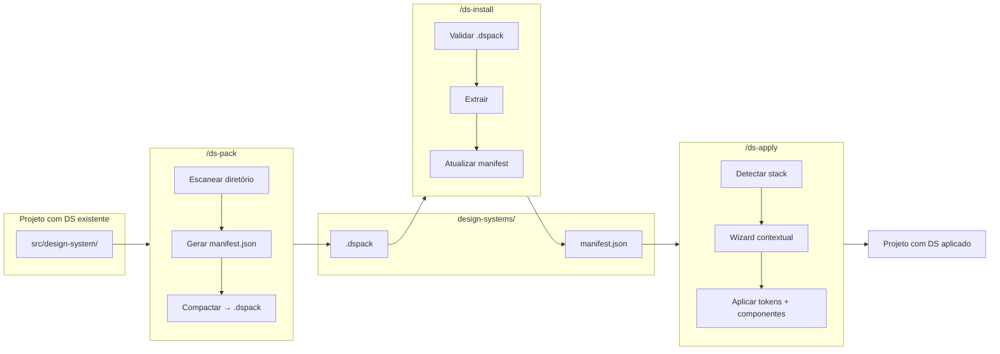
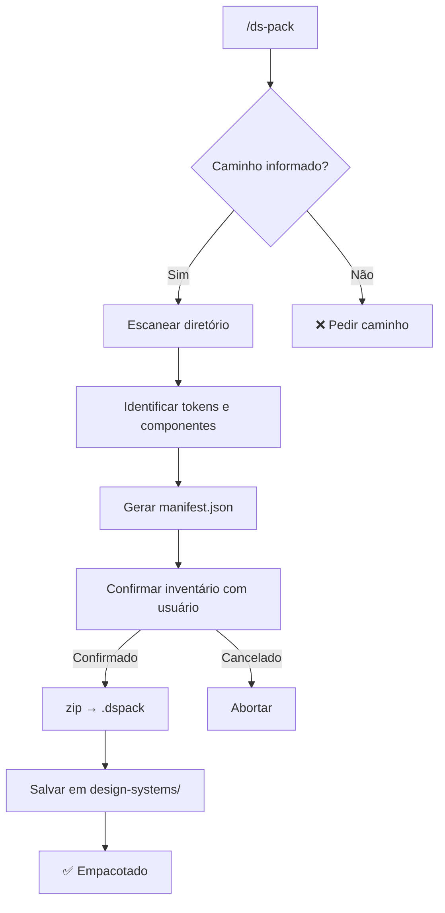
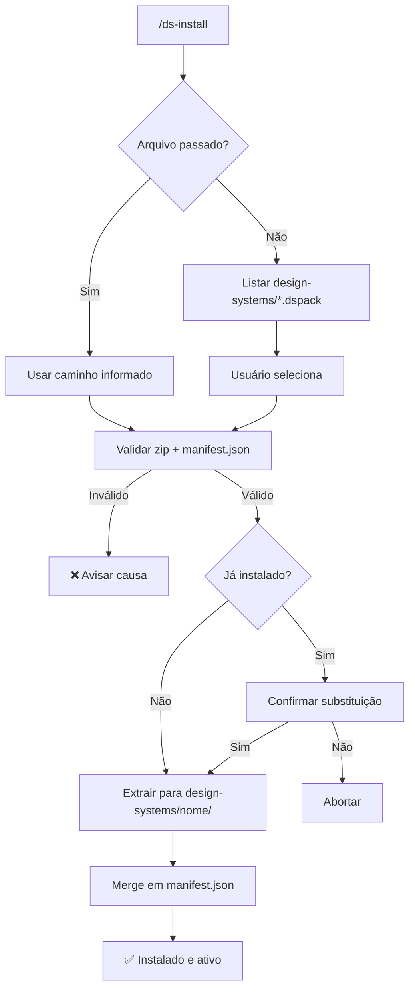
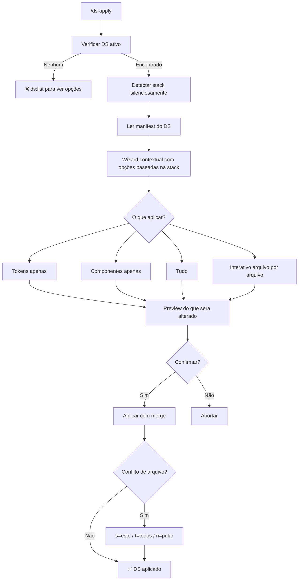
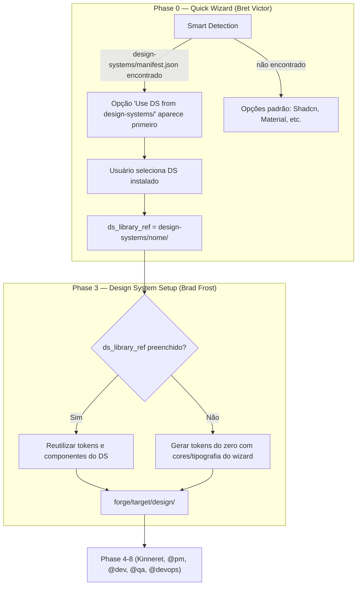

# @eximia-ventures/ds — Design System Manager

> Gerencie, empacote e distribua design systems dentro do Claude Code.
> Baseado em Atomic Design (Brad Frost). Integrado com Squad Forge.

```bash
npm install @eximia-ventures/ds
```

---

## Como funciona

```mermaid
flowchart TD
    A[npm install @eximia-ventures/ds] --> B[postinstall]
    B --> C[design-systems/ criada na raiz]
    B --> D[design-systems/ adicionado ao .gitignore]
    B --> E[Skills instaladas em .claude/commands/]

    E --> F[/ds — Wizard central]
    E --> G[/ds-pack]
    E --> H[/ds-install]
    E --> I[/ds-list]
    E --> J[/ds-apply]
```

---

## Skills disponíveis

| Skill | Descrição |
|-------|-----------|
| `/ds` | Wizard central — menu interativo para todas as operações |
| `/ds-pack` | Empacota um DS existente em `.dspack` |
| `/ds-install` | Instala um `.dspack` no projeto |
| `/ds-list` | Lista DSs instalados e disponíveis |
| `/ds-apply` | Aplica tokens e componentes do DS ativo no projeto |

---

## Fluxo principal



---

## Estrutura do projeto

```
design-system-library/
├── packages/
│   └── cli/                        # Pacote npm @eximia-ventures/ds
│       ├── scripts/
│       │   └── postinstall.js      # Setup automático no install
│       ├── skills/
│       │   ├── ds.md               # /ds — Wizard central
│       │   ├── ds-pack.md          # /ds-pack
│       │   ├── ds-install.md       # /ds-install
│       │   ├── ds-list.md          # /ds-list
│       │   └── ds-apply.md         # /ds-apply
│       └── package.json
│
├── design-systems/                 # DSs oficiais prontos para distribuir
│   └── *.dspack
│
└── squads/
    └── forge/                      # Integração com Squad Forge
        └── workflows/wf-forge.yaml # Smart detection + hook ds_library_ref
```

---

## Formato .dspack

Um `.dspack` é um arquivo zip com estrutura padronizada:

```
meu-ds.dspack
├── manifest.json           ← nome, versão, autor, inventário
├── tokens/
│   ├── tokens.json         ← W3C DTCG format
│   ├── tokens.css          ← CSS custom properties
│   └── tokens.tw.js        ← Tailwind config
├── components/
│   ├── atoms/
│   ├── molecules/
│   ├── organisms/
│   └── templates/
└── README.md
```

**manifest.json:**
```json
{
  "name": "meu-ds",
  "version": "1.0.0",
  "description": "",
  "author": "",
  "methodology": "atomic-design",
  "tokens": {
    "files": ["tokens/tokens.json"],
    "format": "dtcg"
  },
  "components": {
    "atoms": ["Button", "Input", "Label"],
    "molecules": ["FormField", "SearchBar"],
    "organisms": ["Header", "Sidebar"],
    "templates": []
  },
  "created_at": "2026-02-18T00:00:00.000Z"
}
```

---

## /ds — Wizard central

```
🎨 Design System Manager

Projeto: meu-projeto
DS ativo: eximia-default v1.0.0

O que deseja fazer?

  1. 📦 Empacotar   — empacotar um DS existente em .dspack
  2. 📥 Instalar    — instalar um .dspack neste projeto
  3. 📋 Listar      — ver DSs instalados e disponíveis
  4. 🎨 Aplicar     — aplicar o DS ativo no projeto
  5. ❓ Ajuda       — ver dicas e comandos diretos

  0. Sair
```

---

## /ds-pack



---

## /ds-install



---

## /ds-apply



---

## Integração com Squad Forge

O `@eximia-ventures/ds` é detectado automaticamente pelo **Squad Forge** (`*forge`) durante o wizard inicial.



### Como usar com Forge

```bash
# 1. Instale o DS no projeto que será forjado
/ds-install meu-ds.dspack

# 2. Execute o forge — vai detectar automaticamente
@bret-victor *forge meu-squad

# Phase 0: pergunta "Design system framework?"
#   → "Use DS from design-systems/ (via @eximia-ventures/ds)" aparece como primeira opção
#   → Selecione o DS instalado
#   → ds_library_ref é preenchido

# Phase 3: Brad Frost reutiliza os tokens do DS ao invés de gerar do zero
```

---

## design-systems/

A pasta `design-systems/` é criada automaticamente no `npm install` e ignorada pelo git por padrão. Cada desenvolvedor instala localmente os DSs que precisa.

```
projeto/
├── design-systems/          ← gitignored, local de cada dev
│   ├── manifest.json        ← rastreia DSs instalados e DS ativo
│   ├── eximia-default/      ← DS extraído (instalado)
│   └── outro-ds.dspack      ← DS disponível (ainda não instalado)
├── .gitignore               ← design-systems/ adicionado automaticamente
└── package.json
```

**manifest.json:**
```json
{
  "version": "1.0.0",
  "installed": [
    {
      "name": "eximia-default",
      "version": "1.0.0",
      "path": "design-systems/eximia-default/",
      "installed_at": "2026-02-18T00:00:00.000Z"
    }
  ],
  "active": "eximia-default"
}
```

---

## Atomic Design

Todos os componentes seguem a metodologia de Brad Frost:

```
Átomos → Moléculas → Organismos → Templates → Páginas

Button ─┐
Input  ─┼─→ FormField ─┐
Label  ─┘               ├─→ AuthForm ─┐
                        │              ├─→ LoginTemplate ─→ LoginPage
SearchBar ─────────────→ Header ──────┘
```

---

## Roadmap

- [x] CLI skills — `/ds`, `/ds-pack`, `/ds-install`, `/ds-list`, `/ds-apply`
- [x] postinstall — setup automático de `design-systems/` e `.gitignore`
- [x] Integração com Squad Forge — smart detection + hook `ds_library_ref`
- [ ] DS oficial `eximia-default.dspack`
- [ ] Plataforma visual (Fase 2)

---

## Links

- **npm:** [npmjs.com/package/@eximia-ventures/ds](https://npmjs.com/package/@eximia-ventures/ds)
- **GitHub:** [github.com/eximIA-Ventures/design-system-library](https://github.com/eximIA-Ventures/design-system-library)
